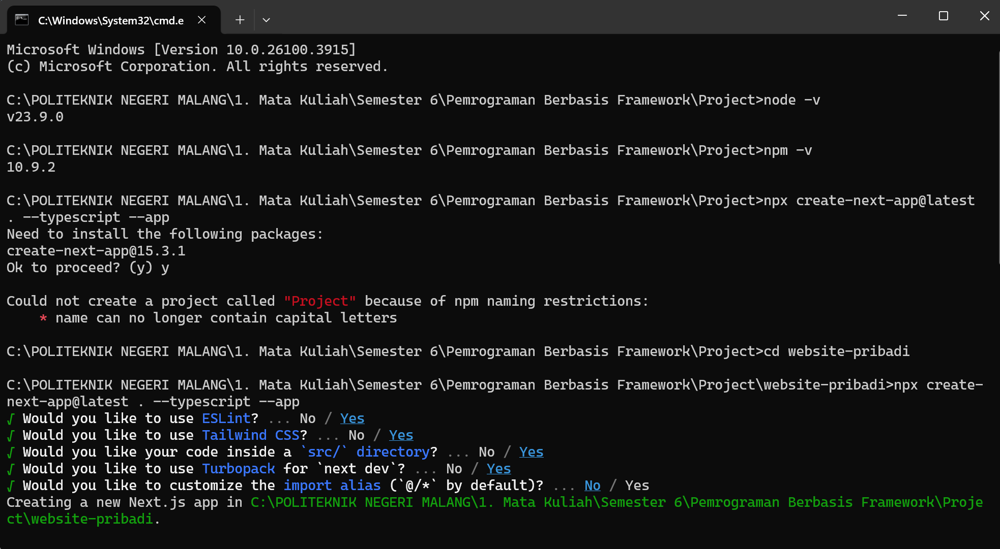

# Laporan Praktikum

|       | Pemrograman Berbasis Framework 2025 |
| ----- | ----------------------------------- |
| NIM   | 2241720225                          |
| Nama  | Bagus Arnovario Wibowo              |
| Kelas | TI - 3A                             |

## Langkah-langkah Praktikum

## Praktikum 1 : Persiapan Lingkungan

1. Pastikan Node.js dan npm sudah terinstal di komputer Anda. Anda dapat memeriksanya dengan 
menjalankan perintah berikut di terminal atau command prompt: 
node -v 
npm -v 
2. Buat direktori baru untuk proyek Next.js Anda: 
mkdir website-pribadi 
cd website-pribadi 
3. Inisialisasi proyek Next.js dengan TypeScript dan App Router: 
npx create-next-app@latest . --typescript –app 

4. Cek konfigurasi postcss.config.mjs:
.png)
5. Cek di app/globals.css, sudah ada import untuk tailwindcss:
.png)
6. Buka app/layout.tsx, tambahkan import './globals.css', dan modifikasi menjadi sebagai berikut:
.png)
7. Jalankan aplikasi Next.js: 
    npm run dev 
Aplikasi akan terbuka di browser pada alamat http://localhost:3000.
.png)

## Praktikum 2 : Membuat Halaman Website

Website pribadi akan memiliki tiga halaman:

• Tentang Saya: Halaman berisi profil singkat dan link ke media sosial. 
• Proyek: Halaman untuk menampilkan proyek-proyek yang telah diselesaikan. 
• Esai: Halaman untuk menampilkan daftar artikel yang telah ditulis.

Langkah-langkah:

1. Buat file app/page.tsx sebagai halaman "Tentang Saya":
